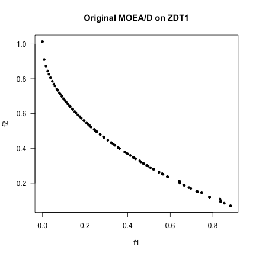
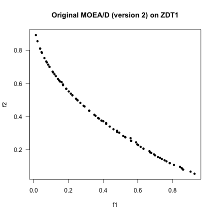
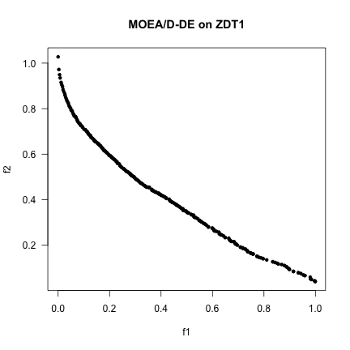

This file describes the experiments using the MOEADr package, as 
part of the results section of the manuscript "_A Component-Wise Perspective on 
Multiobjective Evolutionary Algorithms based on Decomposition_". 

***

# Experiment 1: Replicating MOEA/Ds from the literature

## Introduction
This section presents the replication of published MOEA/D variants using the MOEADr framework. We reproduce two famous versions, namely the original MOEA/D by Zhang and Li [1] and Li and Zhang's MOEA/D-DE [2], and illustrate how to run each of them on a benchmark problem. Notice that the main objective of this section is to illustrate how replication studies could be performed, and not to actually perform them (which would be a topic for another paper). 

MOEADr-compliant test functions (see Vignette [Defining Problems in the MOEADr Package](https://cran.r-project.org/web/packages/MOEADr/vignettes/problem-definition.html)) can be built using, e.g.:


```r
suppressPackageStartupMessages(library(smoof))
suppressPackageStartupMessages(library(MOEADr))

ZDT1  <- make_vectorized_smoof(prob.name  = "ZDT1",
                               dimensions = 30)
```


### 1. Original MOEA/D
The original MOEA/D paper [1] reports two versions of this algorithm. Here we reproduce the first one, reported in Section V-E, pp.721-722. In the MOEADr framework, we define this method using:


```r
problem   <- list(name       = "ZDT1",     # <-- function name
                  xmin       = rep(0, 30), # <-- upper limits for variables
                  xmax       = rep(1, 30), # <-- lower limits for variables
                  m          = 2)          # <-- number of objectives

decomp <- list(name = "SLD", # <-- Simplex-lattice decomposition, with
                H    = 99)    # <-- h = 99 (= 100 subproblems in 2-obj problems)

neighbors <- list(name    = "lambda", # <-- weight-based neighborhood, with 
                  T       = 20,       # <-- neighborhood size T = 20 and
                  delta.p = 1)        # <-- sampling only from the neighborhood

aggfun <- list(name = "wt") # <-- aggregation using weighted Tchebycheff function

variation <- list(list(name  = "sbx",       # <-- SBX operator with
                       etax  = 20,          # <-- eta_X = 20 and
                       pc    = 1),          # <-- crossover prob. = 1
                  list(name  = "polymut",   # <-- polynomial mutation with
                       etam  = 20,          # <-- eta_M = 20 and
                       pm    = 1/30),       # <-- mutation prob. = 1/n
                  list(name  = "truncate")) # <-- truncation (to avoid NaNs in 
                                            # the ZDT implementation from package smoof)

update <- list(name       = "standard", # <-- standard update with
               UseArchive = FALSE)      # <-- no external archive

scaling <- list(name = "none") # <-- no scaling of the objective functions

constraint <- list(name = "none") # <-- No constraint handling

stopcrit <- list(list(name  = "maxiter", # <-- stop criterion:
                      maxiter  = 250))   # <-- 250 iterations

showpars <- list(show.iters = "none") # <-- do not echo the iterations

seed <- 123 # <-- for reproducibility
```

We can now run this algorithm version on the ZDT1 problem: 


```r
out <- moead(problem, decomp, aggfun, neighbors, variation, update,
              constraint, scaling, stopcrit, showpars, seed)
```


```r
# plot output
suppressPackageStartupMessages(library(emoa)) # <-- for function nondominated_points()
Y <- t(nondominated_points(t(out$Y))) # <-- isolate only the nondominated points returned
plot(Y[,1], Y[,2], type = "p", pch = 20, 
     main = "Original MOEA/D on ZDT1", xlab = "f1", ylab = "f2", las = 1)
```



If we want to reproduce the second version suggested in [1] (Section sec. V-F, p. 724), it is just a matter of changing a few definitions:


```r
aggfun <- list(name  = "PBI", # <-- aggregation using PBI, with
                theta = 5)    # <-- theta = 5

scaling <- list(name = "simple") # <-- simple scaling of objective functions

out <- moead(problem, decomp, aggfun, neighbors, variation, update,
              constraint, scaling, stopcrit, showpars, seed)
```


```r
# plot output
Y <- t(nondominated_points(t(out$Y)))
plot(Y[,1], Y[,2], type = "p", pch = 20, 
     main = "Original MOEA/D (version 2) on ZDT1", xlab = "f1", ylab = "f2", las = 1)
```



### 2. MOEA/D-DE
Li and Zhang [2] proposed a variant of the MOEA/D in 2009, in which the SBX recombination is replaced by the usual Differential Evolution operators, namely the (/rand/1)-differential mutation followed by binomial recombination. However, since the authors use a recombination factor $\rho = 1$ (defined in the paper with the more traditional notation $CR = 1$), this essentially amounts as using only the differential mutation and passing the resulting vector forward, without any recombination with the corresponding incumbent solution.

This variant is defined by vector generation using SLD, weighted Tchebycheff aggregation function, a neighborhood sampling probability that is smaller than one, differential mutation and polynomial mutation operators in the variation stack, and restricted update. 

We can reproduce the version described in the paper using:


```r
decomp <- list(name = "SLD", # <-- Simplex-lattice decomposition, with
                H    = 299)  # <-- h = 299 (= 300 subproblems in 2-obj problems)

neighbors <- list(name    = "lambda", # <-- weight-based neighborhood, with 
                  T       = 20,       # <-- neighborhood size T = 20 and
                  delta.p = 0.9)      # <-- sampling only from the neighborhood

aggfun <- list(name = "wt") # <-- aggregation using weighted Tchebycheff function

variation <- list(list(name  = "diffmut",   # <-- Differential mutation with
                       basis = "rand",      # <-- rand basis and
                       phi   = 0.5),        # <-- phi = 0.5
                  list(name  = "polymut",   # <-- polynomial mutation with
                       etam  = 20,          # <-- eta_M = 20 and
                       pm    = 1/30),       # <-- mutation prob. = 1/n
                  list(name  = "truncate")) # <-- truncation (to avoid NaNs in 
                                            # the ZDT implementation from package smoof)

update <- list(name       = "restricted", # <-- standard update with
               nr         = 2,            # <-- replacement limit of 2 and
               UseArchive = FALSE)        # <-- no external archive

scaling <- list(name = "none") # <-- no scaling of the objective functions

constraint <- list(name = "none") # <-- No constraint handling

stopcrit <- list(list(name  = "maxiter", # <-- stop criterion:
                      maxiter  = 300))   # <-- 300 iterations

showpars <- list(show.iters = "none") # <-- do not echo the iterations

seed <- 123 # <-- for reproducibility
```

We can now run the MOEA/D-DE as described in [2] (Sections III-A and IV-A) on the sameZDT1 problem: 


```r
out <- moead(problem, decomp, aggfun, neighbors, variation, update,
              constraint, scaling, stopcrit, showpars, seed)
```


```r
# plot output
Y <- t(nondominated_points(t(out$Y)))
plot(Y[,1], Y[,2], type = "p", pch = 20, 
     main = "MOEA/D-DE on ZDT1", xlab = "f1", ylab = "f2", las = 1)
```



***
***

# Experiment 2: MOEADr + irace

## Introduction
This section contains the experimental setup for the MOEA/D tuning experiments using the MOEADr framework. In this experiment we employ the standard implementation of the [Iterated Racing](http://iridia.ulb.ac.be/irace/), available in the R package [irace](https://cran.r-project.org/web/packages/irace/index.html) (version 2.1).

The reference Pareto-optimal points used for the IGD calculations were obtained from [Qingfu Zhang's home page](http://dces.essex.ac.uk/staff/qzhang/moeacompetition09.htm), in the *pf_data* folder within [this file](http://dces.essex.ac.uk/staff/qzhang/MOEAcompetition/testproblemsourcecode0904.rar).

## How to reproduce the experimental results
To reproduce the results of the manuscript, follow the instructions below:

1. First download the _Manuscript-Version_ branch of the [MOEADr repository](https://github.com/fcampelo/MOEADr/tree/Manuscript-Version) ([click here](https://github.com/fcampelo/MOEADr/archive/Manuscript-Version.zip) for the least-effort way), and unzip it, if needed, in a working folder at your local machine.  
2. Make sure that the manuscript version of the package is installed (and, if not, install the correct version):


```r
if (!("MOEADr" %in% rownames(installed.packages())) | (packageVersion("MOEADr") != "0.2.0")) {
  require(devtools)
  devtools::install_github("fcampelo/MOEADr/MOEADr@Manuscript-Version")
}
```

3. Set the working directory of the analysis as the folder where you saved the files.

4. Run the script *run_irace_experiment.R*:


```r
source("run_irace_experiment.R")
```

and go out for a relaxing weekend (this experiment takes a long time - about 24 hours in our dedicated 24-core machine).

## Training and test instances
In this experiment we adopted the general idea suggested by Bezerra et al. [3], using functions UF1 - UF10 from the the [CEC'2009 benchmark set](http://dces.essex.ac.uk/staff/qzhang/moeacompetition09.htm) and employing disjoint sets of problem dimensions for tuning and evaluation, with $n_v^{tune} \in \left\{20,\dotsc,60\right\} \backslash n_v^{test}$ and $n_v^{test} \in \left\{30,40,50\right\}$. The standard implementations of these functions available in the R package [smoof](https://cran.r-project.org/web/packages/smoof/index.html) (version 1.4) were used.

Following the [definitions of the CEC'2009 competition](http://dces.essex.ac.uk/staff/qzhang/moeacompetition09.htm), the number of subproblems used was fixed as 100 for $m = 2$, and 150 for $m = 3$ (for the Simplex Lattice Design the actual number was 153 for $m = 3$, given the specifics of this method. Please refer to the manuscript for details). 


## Further comments regarding the design of this experiment
This tuning experiment was intended at exploring the potential of the MOEADr framework in leveraging the capabilities of automated algorithm assembly / tuning offered by the Iterated Racing method. Some design decisions had to be made in the design of this experiment, as detailed below (for a complete view of the search space for tuning, see file _./Experiments/irace tuning/parameters.txt_)

- constraint handling: *none* (since the problems are unconstrained)
- Variation stack: we opted for defining a variation stack with between 3 and 4 operators, using the following rationale:  
- first and second operators chosen from the existing "traditional" variation operators available in the MOEADr package: *SBX*, *Polynomial mutation*, *Differential mutation*, and *Binomial Recombination*. In the case of *Differential mutation* only the *rand* basis was investigated, mainly for the sake of simplicity. Further investigations of the *mean* and *wgi* variants will be performed in the near future.
- third operator: can be any of the operators listed above, or *none* (in which case a third operator is not included)  
- fourth operator: can be either *Local search* or *none*.
- after the four operators have been executed, the variation stack wraps up by truncating solutions to the variable limits. This is done simply to prevent problems with some test functions that return NaN's for points outside their domains.
- specific parameters of each operator are tuned independently for each position (e.g., if a configuration with two sequential SBX operators happens, each one has its own independent set of parameters)  
- local search done probabilistically (using $\gamma_{ls}\in(0,0.5)$) when local search is present.  
- Aggregation functions: WT, AWT, and PBI. *Inverted PBI* was not included as a possible scalarization function, since we couldn't validate the MOEADr implementation against the original code (our attempts to reach the author remain unanswered)
- Decomposition strategies: SLD and Uniform. *MSLD* was not included as a possible decomposition method, since we are dealing only with 2 and 3 objectives, which makes it generally unnecessary.


***
# References
- [1] Q. Zhang, H. Li, "MOEA/D: A multiobjective evolutionary algorithm based on decomposition". DOI: [10.1109/TEVC.2007.892759](http://dx.doi.org/10.1109/TEVC.2007.892759)

- [2] H. Li, Q. Zhang, "Multiobjective optimization problems with complicated Pareto sets, MOEA/D and NSGA-II". DOI: [10.1109/TEVC.2008.925798](http://dx.doi.org/10.1109/TEVC.2008.925798).  

- [3] L. Bezerra, M. Lopez-Ibanez, T. Stutzle, "Automatic Component-wise Design of Multi-objective Evolutionary Algorithms". DOI: [10.1109/TEVC.2015.2474158](http://dx.doi.org/10.1109/TEVC.2015.2474158).  
